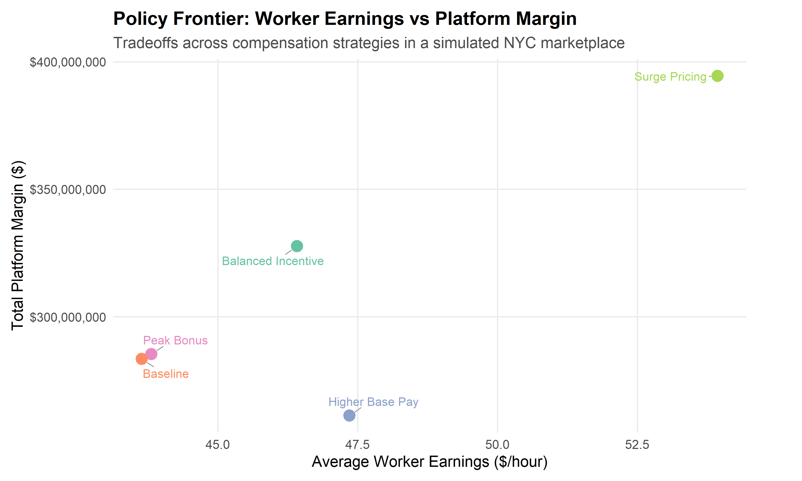

# Marketplace Labor Supply Simulator (NYC Ride-Hail Data)

## Overview

How do compensation strategies affect marketplace outcomes?

This project simulates a ride-hail marketplace using real NYC trip demand data to evaluate how different pay and incentive structures impact:

- Order fulfillment
- Worker earnings
- Platform margin

The model captures worker participation behavior and solves for supply-demand equilibrium under different policy scenarios.

---

## Data

- Source: NYC TLC High Volume For-Hire Vehicle (HVFHV) trip data  
- Period: Feb–Apr 2025  
- Aggregation: Hourly demand by time-of-day and day-of-week  

---

## Approach

### Demand
Demand is derived directly from observed trip volume in NYC.

### Worker Supply
Workers choose whether to participate based on expected hourly earnings:

- Modeled using a logistic response function  
- Higher expected earnings → higher participation probability  

### Market Equilibrium
For each hour:
- Expected trips per worker are calculated  
- Worker participation determines supply  
- Fulfilled vs unfulfilled demand is computed  

---

## Scenarios

The model evaluates five compensation strategies:

- **Baseline** — current pay structure  
- **Higher Base Pay** — uniform pay increase  
- **Peak Bonus** — incentives during high-demand hours  
- **Surge Pricing** — dynamic pay tied to demand  
- **Balanced Incentive** — combination of base + targeted incentives  

---

## Results

### Policy Frontier



**Insight:**  
There is no single optimal policy—tradeoffs exist between worker earnings and platform margin.

- Surge pricing maximizes earnings and margin  
- Balanced incentives provide strong performance across both  

---

### Fulfillment by Scenario


**Insight:**  
Targeted incentives outperform both baseline and uniform pay increases in maximizing fulfillment.

---

### Robustness (Monte Carlo)


**Insight:**  
Results are stable across a wide range of behavioral assumptions:

- Balanced incentives consistently achieve the highest fulfillment  
- Surge pricing consistently maximizes platform margin  
- Uniform base pay increases are less efficient  

---

## Key Takeaways

- **Targeted incentives outperform blunt pay increases**  
- **Surge pricing maximizes profitability but reduces fulfillment**  
- **Balanced incentive structures deliver the best overall performance**  
- **Results are robust to uncertainty in worker behavior**  

---

## Technical Highlights

- Built in R using `dplyr`, `ggplot2`, and `arrow`  
- Equilibrium-based simulation model  
- Logistic participation modeling  
- Scenario analysis across multiple compensation strategies  
- Monte Carlo simulation for robustness  

---

## Why This Matters

Marketplace design decisions—especially around compensation—directly impact:

- Service reliability  
- Worker welfare  
- Platform profitability  

This project demonstrates how data and modeling can be used to evaluate those tradeoffs in a structured, quantitative way.

---

## How to Run

1. Download TLC trip data (HVFHV parquet files)
2. Run:

```r
scripts/01_build_hourly_demand.R
scripts/03_run_main_scenarios.R
scripts/05_run_monte_carlo.R
